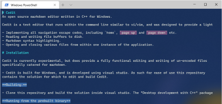

# Cedit
An open source markdown editor written in C++ for Windows.

Cedit is a text editor that runs within the command line similar to vi/vim, and was designed to provide a lightweight and quick tool to create and edit markdown files. As such Cedit provides the navigation and editing functionality to write markdown documents within a terminal. This includes:

- Implementing all navigation escape codes, including `home`, `page up` and `page down` etc. 
- Reading and writing file buffers to disk.
- Markdown syntax highlighting.
- Opening and closing various files from within one instance of the application.

# Installation

Cedit is currently experimental, but does provide a fully functional editing and writing of un-encoded files 
specifically catered for markdown. 

- Cedit is built for Windows, and is developed using visual studio. As such for ease of use this repository 
contains the solution for which to edit and build Cedit.

**Building:**

- Clone this repository and build the solution inside visual studio. The "Desktop development with C++" package is re required to build Cedit.

**Running from the prebuilt binary**

- The solution directory contains the pre-built binaries used for debugging Cedit, which currently contains the full functionality offered by Cedit.
This can be found under `cedit/x64/Debug/cedit.exe` . To run this from the command line add 
`cedit/x64/Debug/` to your system path or navigate to the directory and run `./cedit.exe [path_to_file]` .

Note just like other terminal editors supplying a path to a file will open that file with Cedit, and omitting
 this will open a blank file buffer.

# Usage

|Shortcut|Description|
|-----|-----|
|`ctrl + q`|Quit without saving|
|`ctrl + s`|Save buffer|
|`ctrl + t`|Create a table|
|`ctrl + o`|Open a file|

# Notes

Cedit is experimental, and born from the need of the author. As such Cedit does not perform as well as other 
terminal editors such as Vi/Vim. Syntax highlighting also works based off the screen buffer, rather than the file buffer
 and is not perfect. The experimental nature of Cedit does not make it a replacement for any other text editor, and 
evolves as the authors needs change.
